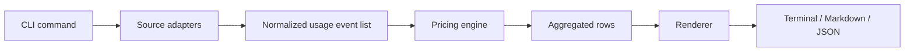
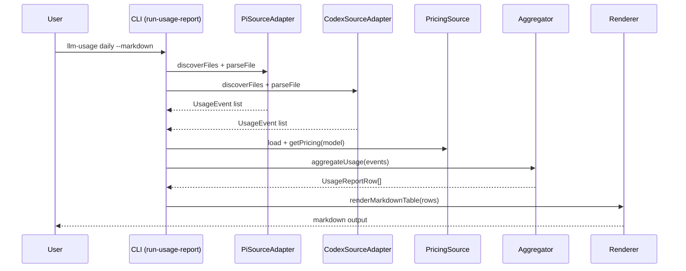

# Architecture

## High-level flow

The reporting pipeline is linear and intentionally simple:

1. **CLI command parsing** (`src/cli`)
2. **Source discovery + parsing** (`src/sources`)
3. **Event normalization** (`src/domain`)
4. **Pricing resolution** (`src/pricing`)
5. **Aggregation by period/source** (`src/aggregate`)
6. **Rendering** (`src/render`)

## Runtime sequence

## Module layout

### `src/cli`

- `create-cli.ts`: declares commands and flags.
- `run-usage-report.ts`: orchestrates end-to-end report generation.
- `index.ts`: executable entrypoint.

### `src/sources`

- `source-adapter.ts`: adapter contract used by all sources.
- `pi/pi-source-adapter.ts`: parser for `.pi` sessions.
- `codex/codex-source-adapter.ts`: parser for `.codex` sessions.

### `src/domain`

- `usage-event.ts`: canonical event type and constructor.
- `usage-report-row.ts`: output row types.
- `normalization.ts`: shared normalization helpers.

### `src/pricing`

- `types.ts`: pricing interfaces.
- `cost-engine.ts`: cost estimation logic.
- `static-pricing-source.ts`: default local pricing fallback.
- `litellm-pricing-fetcher.ts`: remote pricing loader with cache/offline support.

### `src/aggregate`

- `aggregate-usage.ts`: period bucketing + totals.

### `src/render`

- `row-cells.ts`: shared table cells/formatting.
- `terminal-table.ts`: default terminal output.
- `markdown-table.ts`: markdown output.

### `src/utils`

- `time-buckets.ts`: timezone-aware daily/weekly/monthly keys.
- `discover-jsonl-files.ts`: recursive sorted file discovery.

## Core data model

### Usage event

A parsed log line is converted into a `UsageEvent` with normalized numeric fields.

Important guarantees:

- token fields are non-negative integers
- timestamp is valid ISO string
- `costMode` is either `explicit` or `estimated`

### Report rows

Aggregation produces rows in this order:

1. one row per period/source (`pi`, `codex`, or future sources)
2. one period combined row when there are multiple sources in that period
3. one grand total row (`periodKey = ALL`)

## Design choices

### Source adapter pattern

Each source implements the same contract:

- discover files
- parse one file into normalized events

This keeps format-specific logic isolated and makes new sources straightforward to add.

### Pricing as a separate stage

Parsing does not depend on pricing. Parsing produces usage events first; pricing is applied later. This separation keeps parsing deterministic and easier to test.

### Deterministic output

Sorting rules are explicit:

- periods are sorted ascending
- sources are sorted with `pi` then `codex` then lexical fallback
- model names are deduplicated and sorted

### Failure tolerance

Malformed lines are ignored in adapters instead of stopping the entire report. This is deliberate: one bad session line should not block all usage reporting.
