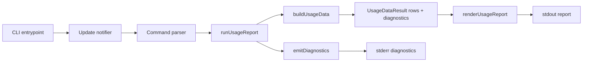
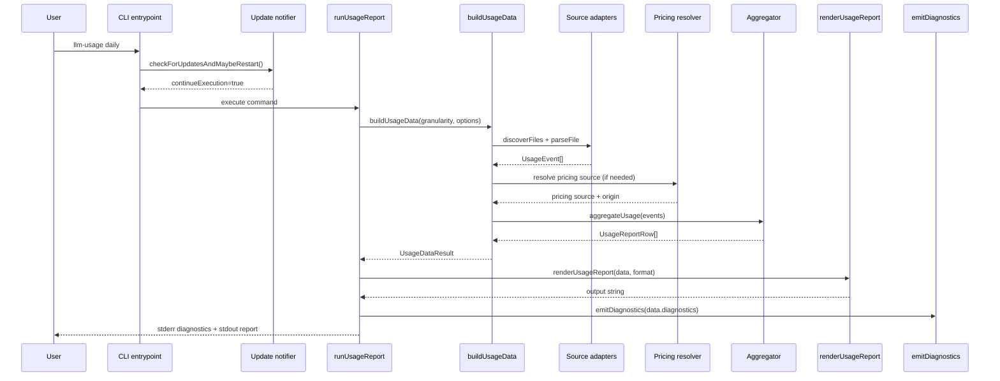
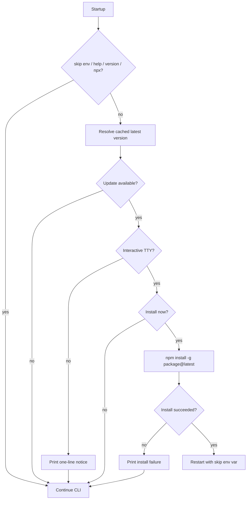

# Architecture

## High-level flow

The runtime pipeline is split into clear reporting layers:

1. **CLI bootstrap** (`src/cli/index.ts`)
2. **Startup update check** (`src/update`)
3. **CLI command parsing** (`src/cli/create-cli.ts`)
4. **Usage data build** (`src/cli/build-usage-data.ts`)
   - option validation
   - adapter wiring/discovery/parsing
   - provider/date filtering
   - pricing resolution
   - aggregation
   - diagnostics payload generation
5. **Report rendering** (`src/render/render-usage-report.ts`)
6. **Diagnostics emission** (`src/cli/emit-diagnostics.ts`)
7. **Output write** (`stdout` for report body, `stderr` for diagnostics)

## Runtime sequence

## Update notifier flow

## Module layout

### `src/cli`

- `create-cli.ts`: declares commands and flags.
- `build-usage-data.ts`: builds rows + diagnostics with no logger side effects.
- `emit-diagnostics.ts`: prints diagnostics to stderr.
- `run-usage-report.ts`: orchestrates build/render/emit.
- `usage-data-contracts.ts`: reporting contracts (`UsageDataResult`, `UsageDiagnostics`, deps).
- `package-metadata.ts`: resolves package metadata across runtime layouts.
- `index.ts`: executable entrypoint.

### `src/sources`

- `source-adapter.ts`: adapter contract used by all sources.
- `create-default-adapters.ts`: default adapter factory (`pi`, `codex`, `opencode`) and override validation (`--source-dir` directory sources, dedicated flags for DB-backed sources).
- `pi/pi-source-adapter.ts`: parser for `.pi` sessions.
- `codex/codex-source-adapter.ts`: parser for `.codex` sessions.
- `opencode/opencode-source-adapter.ts`: parser for OpenCode SQLite usage history.
- `opencode/opencode-db-path-resolver.ts`: deterministic default OpenCode DB path candidates by OS.

### `src/domain`

- `usage-event.ts`: canonical event type and constructor.
- `usage-report-row.ts`: output row types.
- `normalization.ts`: shared normalization helpers.

### `src/config`

- `runtime-overrides.ts`: environment-variable runtime knobs with bounds and defaults.
- `env-var-display.ts`: active override discovery + display formatting.

### `src/pricing`

- `types.ts`: pricing interfaces.
- `cost-engine.ts`: cost estimation logic.
- `static-pricing-source.ts`: static pricing source helper (used in tests/tooling).
- `litellm-pricing-fetcher.ts`: LiteLLM pricing loader with cache/offline support.

### `src/update`

- `update-notifier.ts`: startup update check, npm registry lookup/cache, optional install and restart.

### `src/aggregate`

- `aggregate-usage.ts`: period bucketing + totals.

### `src/render`

- `render-usage-report.ts`: format dispatch (`terminal`, `markdown`, `json`).
- `terminal-style-policy.ts`: source + row-type styling policies.
- `terminal-table.ts`: terminal table rendering.
- `markdown-table.ts`: Markdown table rendering.
- `report-header.ts`: boxed report title + timezone.
- `row-cells.ts`: shared table cells/formatting.

### `src/utils`

- `time-buckets.ts`: timezone-aware daily/weekly/monthly keys.
- `discover-jsonl-files.ts`: recursive sorted file discovery.
- `read-jsonl-objects.ts`: streaming JSONL reader used by adapters.
- `logger.ts`: stderr logger for diagnostics.

## Core data model

### Usage event

A parsed log line is converted into a `UsageEvent` with normalized numeric fields.

Important guarantees:

- token fields are non-negative integers
- timestamp is valid ISO string
- `costMode` is either `explicit` or `estimated`

### Report rows

Aggregation produces rows in this order:

1. one row per period/source (`pi`, `codex`, `opencode`, or future sources)
2. one period combined row when there are multiple sources in that period
3. one grand total row (`periodKey = ALL`)

## Design choices

### Reporting layers are explicit

Reporting is split into:

- **build** (`buildUsageData`) for data + diagnostics
- **render** (`renderUsageReport`) for format-specific string output
- **emit** (`emitDiagnostics`) for stderr diagnostics

This keeps report payloads data-only on stdout (for JSON/Markdown) while retaining stderr diagnostics, and makes each stage easier to test.

### Source adapter pattern

Each source implements the same contract:

- discover files
- parse one file into normalized events
- optionally expose parse diagnostics (`skippedRows`) per parsed file

This keeps format-specific logic isolated and makes new sources straightforward to add.

### Pricing as a separate stage

Parsing does not depend on pricing. Parsing produces usage events first; pricing is applied later.

### Deterministic output

Sorting rules are explicit:

- periods are sorted ascending
- sources follow adapter registration order, then lexical order for unknown ids
- model names are deduplicated and sorted

### Terminal styling policy maps

Terminal styling is centralized into policy maps:

- source policy (`pi`, `codex`, `opencode`, unknown)
- row-type policy (`period_source`, `period_combined`, `grand_total`)

This keeps styling behavior explicit and testable.
