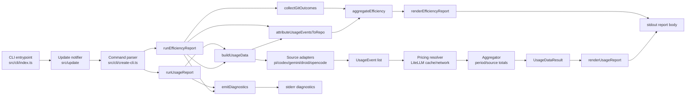
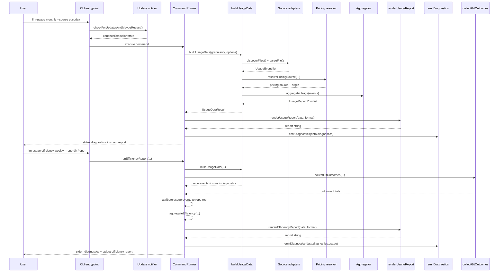

# Architecture

## High-level design

`llm-usage-metrics` is built as a deterministic reporting pipeline with explicit boundaries:

1. **CLI orchestration** parses user intent.
2. **Source adapters** discover and parse source-native data.
3. **Domain normalization** enforces canonical event contracts.
4. **Pricing** resolves explicit/estimated cost values.
5. **Aggregation** buckets events by period and source.
6. **Rendering** formats rows for terminal/markdown/json.
7. **Diagnostics emission** reports operational context on `stderr`.

This keeps source-specific complexity isolated and report output deterministic.

`efficiency` reports reuse the usage pipeline, attribute usage events to a repository root, then join repo-scoped usage totals with local Git outcome totals.

## Runtime flow (flowchart)

## End-to-end sequence

## Module map

- `src/cli`: command creation, validation, orchestration, diagnostics contracts
- `src/sources`: adapter contract + source-specific parsers
- `src/domain`: normalized contracts and constructors
- `src/pricing`: LiteLLM loader/cache + cost engine
- `src/aggregate`: daily/weekly/monthly bucketing and totals
- `src/render`: terminal/markdown/json formatting
- `src/efficiency`: git-outcome collection and efficiency aggregation
- `src/update`: startup update check

## Core invariants

- deterministic ordering (period/source/model)
- source parsing isolated behind adapter contract
- diagnostics on `stderr`, report data on `stdout`
- OpenCode runtime parsing is read-only (`node:sqlite`)
- unresolved cost values are surfaced explicitly (`-` / `~$...` semantics)
