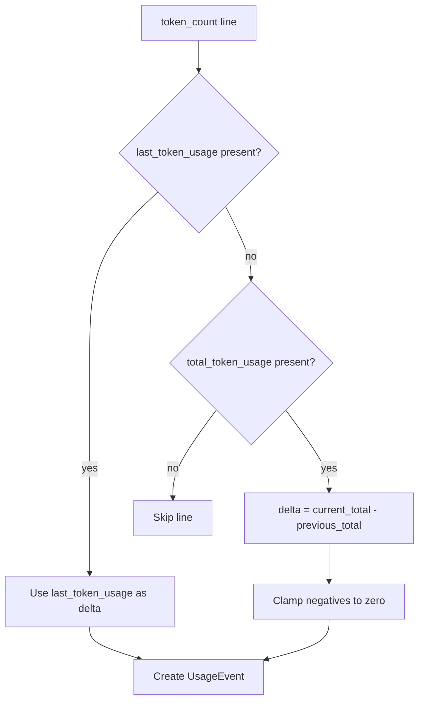

# Parsing and Normalization

## File discovery

- Directory-backed adapters (`pi`, `codex`) use recursive discovery for `*.jsonl` files and return paths in deterministic sorted order.
- OpenCode uses a deterministic SQLite DB path resolver (or `--opencode-db` when explicitly provided).

## `.pi` parsing

Source file: `src/sources/pi/pi-source-adapter.ts`

### Recognized line types

- `session`: captures session id and backup timestamp
- `model_change`: updates provider/model state
- `message`: potential usage record

### Usage extraction

Usage is read from:

1. `line.usage` when valid
2. `line.message.usage` as alternate source

Recognized fields:

- input: `input`
- output: `output`
- reasoning: `reasoning`, `reasoningTokens`, `reasoningOutput`, `outputReasoning`
- cache read: `cacheRead`
- cache write: `cacheWrite`
- total tokens: `totalTokens`
- cost: `usage.cost.total`

### Provider filtering

The adapter receives a provider filter function and applies it before creating events.

## `.codex` parsing

Source file: `src/sources/codex/codex-source-adapter.ts`

### Recognized line types

- `session_meta`: session id and model provider
- `turn_context`: current model
- `event_msg` with `payload.type = token_count`: usage info

### Delta logic

Codex data can provide either:

- `last_token_usage` (already a delta), or
- `total_token_usage` (cumulative)

Rules:

- if `last_token_usage` is present, use it directly
- otherwise compute delta as `current_total - previous_total`
- negative deltas are clamped to zero

### Codex input semantics

Codex `input_tokens` includes cached input. The adapter stores:

- `inputTokens = input_tokens - cached_input_tokens`
- `cacheReadTokens = cached_input_tokens`

This avoids double counting input + cache read later.

### Legacy model default

When model metadata is missing, model is set to:
`legacy-codex-unknown`

## `opencode` parsing

Source file: `src/sources/opencode/opencode-source-adapter.ts`

### Data source and discovery

- reads OpenCode SQLite usage history in read-only mode (`node:sqlite`)
- discovery order:

1. explicit `--opencode-db` path (must be readable)
2. deterministic OS-specific default path candidates (`src/sources/opencode/opencode-db-path-resolver.ts`)

### Extraction query and fallback

- primary query reads assistant rows from `message` table using `json_extract(data, '$.role') = 'assistant'`
- deterministic ordering: `ORDER BY <timestamp>, <id>`
- if `json_extract` is unavailable, adapter falls back to a broader query and performs assistant-role filtering in JavaScript

### Field mapping

- provider: `providerID` fallback `provider`
- model: `modelID` fallback `model`
- tokens:
  - input: `tokens.input`
  - output: `tokens.output`
  - reasoning: `tokens.reasoning`
  - cache read: `tokens.cache.read`
  - cache write: `tokens.cache.write`
  - total: `tokens.total`
- cost: `cost` when numeric and non-negative; otherwise omitted for pricing-stage estimation

### Drift/error handling

- probes schema via `sqlite_master` and `PRAGMA table_info('message')`
- retries busy/locked SQLite errors with bounded backoff, then fails with actionable guidance
- malformed JSON rows or rows with missing required usage/timestamp/session fields are skipped

## Shared normalization (`src/domain/normalization.ts`)

- non-numeric and missing token fields normalize to `0`
- token values are truncated to integers and clamped to non-negative
- blank/invalid cost values become `undefined`
- cost is clamped to non-negative
- timestamps are validated and converted to ISO
- model lists are trimmed, deduplicated, and sorted

## Event creation (`createUsageEvent`)

`createUsageEvent` enforces domain-level constraints:

- non-empty `source` and `sessionId`
- valid timestamp
- consistent `costMode`
  - explicit mode requires a cost
- total token defaulting rule:
  - use declared `totalTokens` when positive
  - otherwise compute from components
