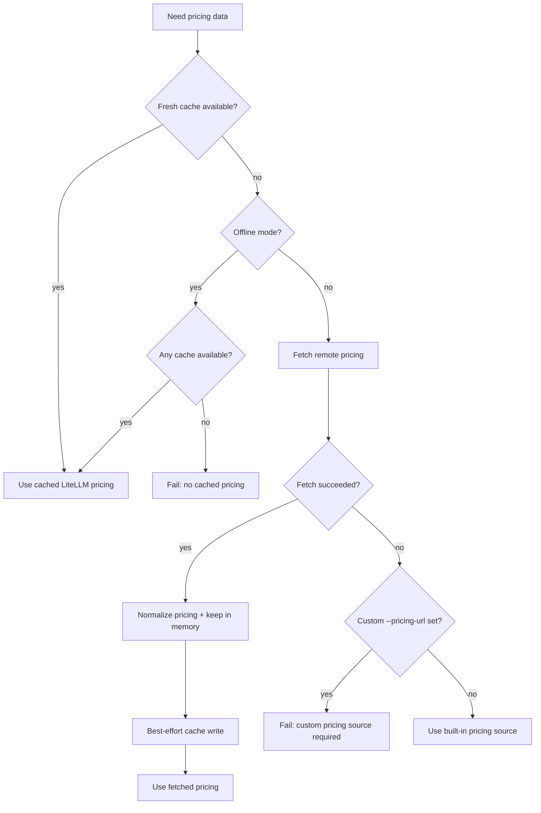

# Pricing and Cost Calculation

## Cost modes

Each event has one of two modes:

- `explicit`: cost came from source logs
- `estimated`: cost is missing or computed from model pricing

Explicit cost is never overwritten.

## Pricing source resolution



### 1) LiteLLM pricing fetcher

Source file: `src/pricing/litellm-pricing-fetcher.ts`

Behavior:

- fetches LiteLLM model pricing JSON
- normalizes per-token values into per-1M token values
- caches data locally
- supports offline mode

Cache behavior:

- tries fresh cache first
- in offline mode, stale cache is allowed
- if network fetch succeeds but cache write fails, pricing is still used in memory

### 2) Built-in pricing source

Source file: `src/pricing/static-pricing-source.ts`

Used when remote LiteLLM pricing cannot be loaded and no custom `--pricing-url` is required.

Includes a compact default OpenAI model map and aliases.

## Model resolution

LiteLLM model lookup tries, in order:

1. direct exact match
2. provider-prefix stripping (`openai/model` -> `model`)
3. longest prefix match for versioned model ids
4. fuzzy match (bounded Levenshtein distance)

Resolved aliases are cached in memory per process run.

## Cost engine

Source file: `src/pricing/cost-engine.ts`

Estimated cost formula (all per 1M token rates):

```text
input + output + cacheRead + cacheWrite + optional reasoning
```

Reasoning tokens are billed only when pricing says `reasoningBilling = separate`.

If model pricing is not found, event stays in estimated mode with `costUsd` left undefined.
